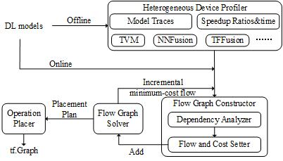

# Talos: Weighted Speedup-Aware Device Placement of Deep Learning Models

传统科技资源及服务启动需要时间较长，会严重影响服务版本的升级、回滚等正常运维时的正常服务时间，本构件可对科技资源服务中的典型深度学习服务，分析服务中算子在不同硬件上的运行时间，并给出放置决策。

ipdps 20投稿，reject
ICS 21投稿，reject
asap 21投稿中

## 技术架构

Note that our current open sourced code are mainly in Flow Graph Solver. Other codes will be gradually open sourced.



1. Heterogeneous Device Profiler: tries to run models on different devices and collect their traces by using TensorFlow profile API in an offline manner.

2. Flow Graph Constructor: When operations arrive, analyses inter-model operation dependencies from traces and initialize a new minimum-cost flow graph in an online manner.

3. Flow Graph Solver incrementally employs typical MCF algorithms to get minimum-cost flows. 

4. Operation Placer uses TensorFlow Distributed API \cite{tfdistributed} to place operations in tf.Graph.

## 技术特色

Efficient device placement of deep learning (DL) models is a big challenge when heterogeneous devices are considered. DL models consist of many operations, each of which has diverse speedups, such as CPU/GPU. For device placement of a DL model, two novel approaches, based on average speedup and transient speedup respectively, have been proposed to exploit the speedup features. But both of them are insufficient to handle them elaborately and therefore the Total Operation Completion Time (TOCT) cannot be optimized efficiently. To address this challenge, we present Talos, a flow-based mechanism to optimize device placement of multiple DL models with weighted speedup-awareness. 

## 代码结构

```
|main|java|DataReader.java: load json data from profiler outputs based on pytorch 1.7.1
|main|java|Span.java: calculate idle time when doing device placement
|main|java|SpeedupResolver.java: MCF resolver for 2 DL models.
```

## 部署方式

Run on java8.

## 使用说明

Note that example data are statically defined in Data Reader.

```
java SpeedupResolver
```

And we will get a device placement result with certain operation inputs.
